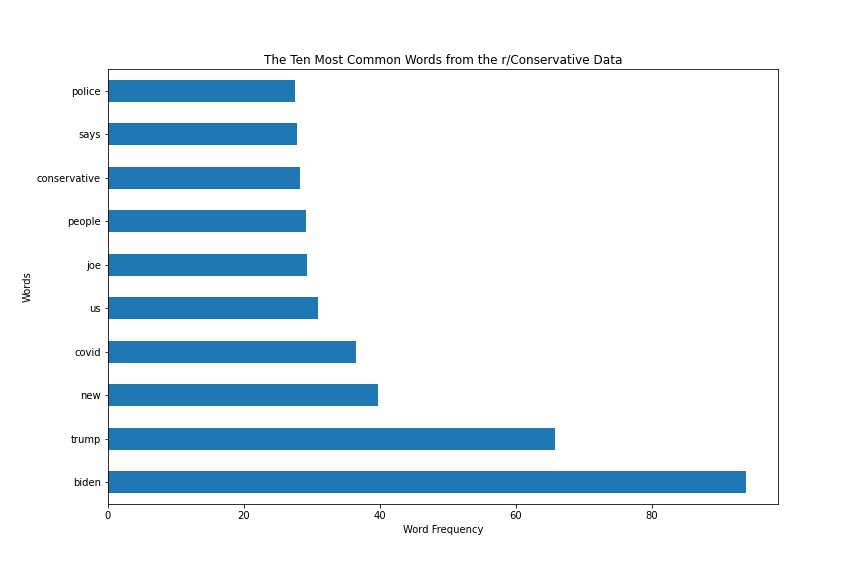
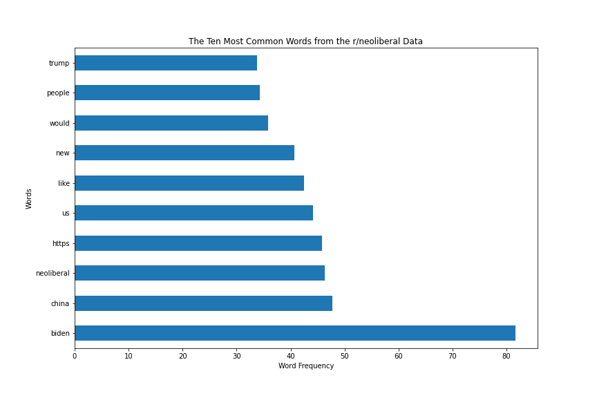
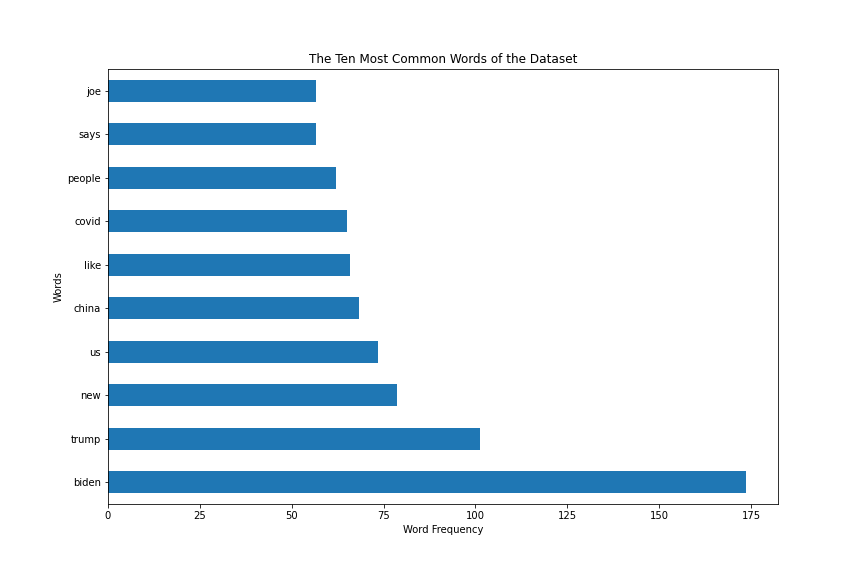

# Project 3 - A Tale of Two Subreddits

---
## Contents
- [Background](#Background)
- [Problem Statement](#Problem-Statement)
- [Repository Directory](#Repository-Directory)
- [Data Dictionary and Data Sources](#Description-of-Data)
- [Modeling](#Modeling)
- [Findings and Recommendations](#Findings-and-Recommendations)
- [Addtional Sources](#Additional-Citations)
---
## Background 
One of the most popular and widely-used repositories of old Reddit data, Pushshift, has run into an issue. While archiving some late 2020 data from r/Conservative and r/neoliberal posts, the two files were merged and mixed in a clerical error. The data about where each post came from and the post authors were deleted, and now the archivists have to recategorize these posts one by one.

The problem with this, though, is that data is continually coming in from Reddit, and since the Pushshift archives are maintained by volunteers, resources are spread thin. This is where machine learning can come in to save the day!

This project explored the use of the following:
- A Multinomial Naive Bayes classifier
- A Random Forest Classifier
- A Polynomial Kernel SVM

Whichever model performs best on a selection of test data will be used to automatically categorize the missing posts and save the Pushshift team a lot of time!
## Problem Statement
---
The objective of this project is to create a classification model that can sort between the posts from r/Conservative and r/neoliberal as accurately as possible, so that the Pushshift team can get back to the important job of archiving reddit data.

## Repository Directory
---
Here's a list of all the objects contained in this repository and links to each object:
- [Project 3 Presentation](./project-03-presentation.pdf) -  My presentation for this project.
- [Assets Folder](./assets) - Contains all of the visualizations I created for this project, as well as some misc. .md files
- [Datasets Folder](./datasets) - Contains all of the data I needed to create the models.
- [Imports, Cleaning and EDA Notebook](./code/01_cleaning_eda.ipynb) - This details how data was gathered from Reddit and the cleaning process, as well as some EDA on the resulting data.
- [Modeling and Conclusions Notebook](./code/02_modeling_conclusions.ipynb) - This details the creation and iteration though each model, as well as my conclusions and recommendations.

## Description of Data
---
I gathered the data using [Pushshift's](https://github.com/pushshift/api) API. This data was gathered from **r/Conservative** and **r/neoliberal** from January 2021 to June 2021. After cleaning the data, I was left with the following dataset:
|Dataset|Size|Source|
|---|---|---|
|`raw_text_data.csv`|4.5 MB|[Reddit](https://www.reddit.com/)|

This dataset had the following features/columns:
|Feature|Type|Description|
|---|---|---|
|**selftext**|*object*|The description of a post|
|**subreddit**|*object*|The source of the post, either Conservative or neoliberal|
|**title**|*object*|The title of the post|
|**text**|*object*|A concatenation of the `title` and `selftext` features|
|**Target_col**|*object*|The **target** of the data - A binarization of `subreddit` where 0 represented r/Conservative and 1 represented r/neoliberal.|

I used TF-IDF to transform this text data into a form a machine can understand. After doing this, I created the following charts of the ten most common words in both classes as well as overall:

## Modeling
---
After cleaning my data, I created three models in an attempt to create the most accurate model possible. Here are the accuracies, recall, and precision for the best iteration of each model:

|Model|Training Accuracy|Testing Accuracy|Recall|Precision|
|---|---|---|---|---|
|**Random Forest Classifier**|0.68|0.67|0.67|0.68|
|**Naive Bayes Classifier**|0.72|0.72|0.72|0.72|
|**Kernel SVM Classifier**|0.72|0.74|0.67|0.68|

Details regarding the other iterations of each model can be found in [this](./code/02_modeling_conclusions.ipynb) notebook. The order of the models above was the same order that I created each model in. This was in an attempt to create the most accurate model possible.

## Findings and Recommendations
---
Out of all the models I created, the best performing model was the Kernel SVM classifier with a 74% accuracy on the testing set. Although this does represent a 24% increase over the baseline model, I still feel that this result could be better, despite the data given. I believe the main drivers of this low accuracy are the similarity between the two subreddits and the lack of data from each post.

Looking back at the top words for each subreddit, it's clear that the titles from both subreddits are very similar, as they share **4** top ten words in common. This high similarity makes clean classification much more difficult.

Also, more data could have been extracted from the titles and descriptions. One thing I could have looked for in the data was the use of emojis, as it seems like r/neoliberal used these far more often than r/Conservative.

Either way, we are still left with a model that can predict the subreddit of a post based on the title and description alone, which is what Pushshift needs in order to correct the clerical error in the 2020 archive data. The model would still be very useful here, but the process of resorting the data should be done in chunks to catch misclassifications.

Another thing to consider is the use of a different model with more predictive power, such as a neural net or a more finely tuned SVM model. The issue here is that the creation of these models would represent a significant time sink. 

Finally, it is important to remember that this model was trained specifically for the purpose of classifying posts during the late 2020 time frame. This model would not perform well outside of this time frame due to the everchanging landscape that is politics.

## Additional Citations
---

- [A Stackoverflow thread that helped me understand pd.date_range](https://stackoverflow.com/questions/59882714/python-generating-a-list-of-dates-between-two-dates)
-[An epoch time to datetime converter](https://www.epochconverter.com/batch)
-[Subreddit stats - A site I used to gather basic Reddit statistics](https://subredditstats.com/)
-[Another Stackoverflow thread that helped me convert pandas datetimes to epoch time](https://stackoverflow.com/questions/15203623/convert-pandas-datetimeindex-to-unix-time)
-[My source of stop words for this project](https://stackoverflow.com/questions/5511708/adding-words-to-nltk-stoplist)
-[Guidance on SVMs in classification problems](https://www.csie.ntu.edu.tw/~cjlin/papers/guide/guide.pdf)
-[The source for the shocked woman image I used in my presentation](https://www.maxpixel.net/Woman-Expression-Surprised-Shocked-Confused-5951730)
-[Source for the tree clipart from the presentation](https://openclipart.org/detail/232721/barren-tree-silhouette)
-[Source for the header image](https://pixabay.com/illustrations/reddit-com-vote-comment-submit-1007072/)